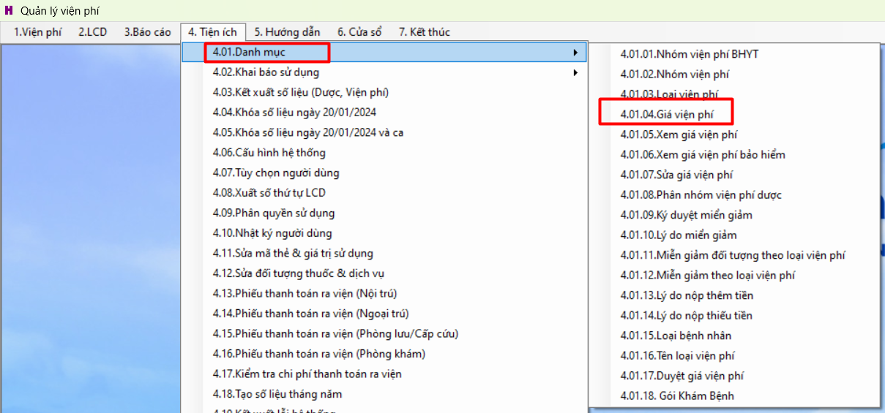
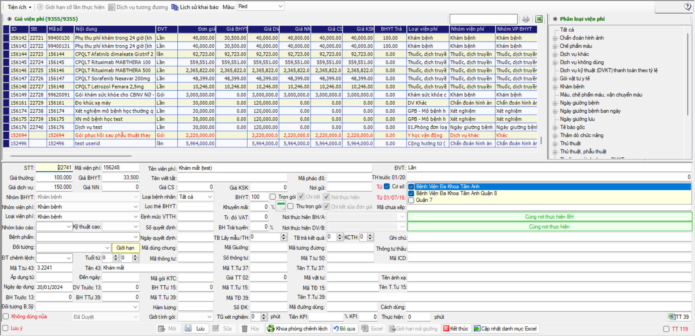
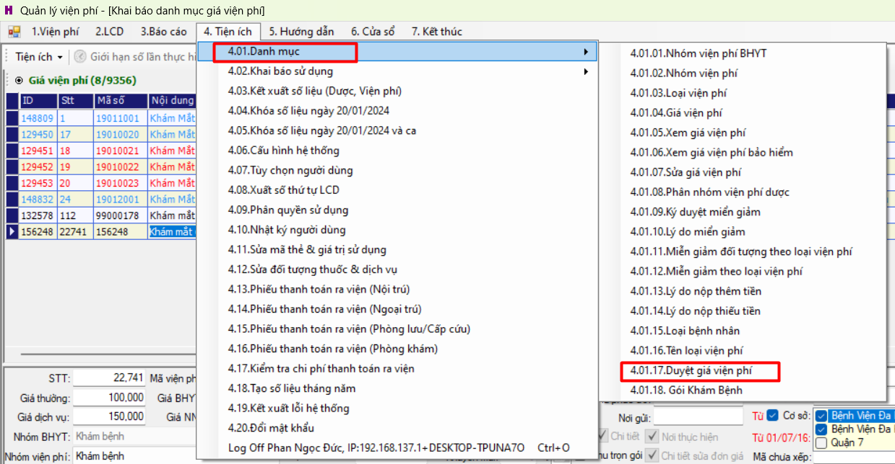
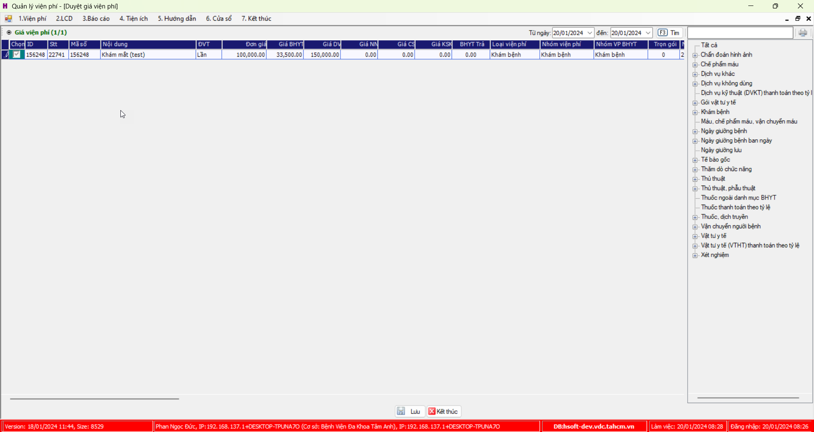

# Tạo giá dịch vụ

## Tạo dịch vụ
### Tạo giá dịch vụ
1. [VP] >> Chọn `4.Tiện ích` >> `4.01.Danh mục` >> `4.01.04. Giá viện phí`

2. Nhập thông tin giá >> chọn `Lưu`

### Duyệt giá viện phí

1. [VP] >> Chọn `4.Tiện ích` >> `4.01.Danh mục` >> `4.01.17. Duyệt giá viện phí`

2. Tích vào giá viện phí cần duyệt >> Chọn `Lưu`

