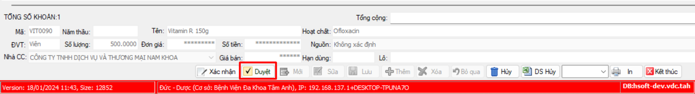

# Dự trù kho

## Quy trình

## Step
### Tạo phiếu dự trù

1. Chọn `4.Dự trù` >> `4.01 Phiếu dự trù`

2. Chọn Kho xuất, kho nhập
3. Thêm thuốc
4. Lưu thông tin

5. Chọn `2.Xuất kho` >>  `2.03 Duyệt cấp theo kho dự trù`

6. Chọn button `Duyệt`

7. Chọn "Kho xuất", "Kho nhập", "Số phiếu" >> chọn `Đồng ý`

8. Chọn `Xác nhận` để hoàn tất

Như vây đã hoàn thành, tồn kho sẽ tăng cho kho dự trù và giảm cho kho duyệt dự trù