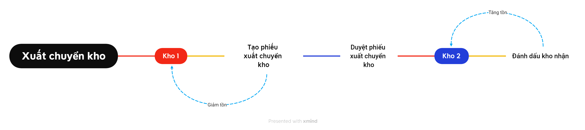
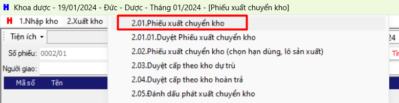
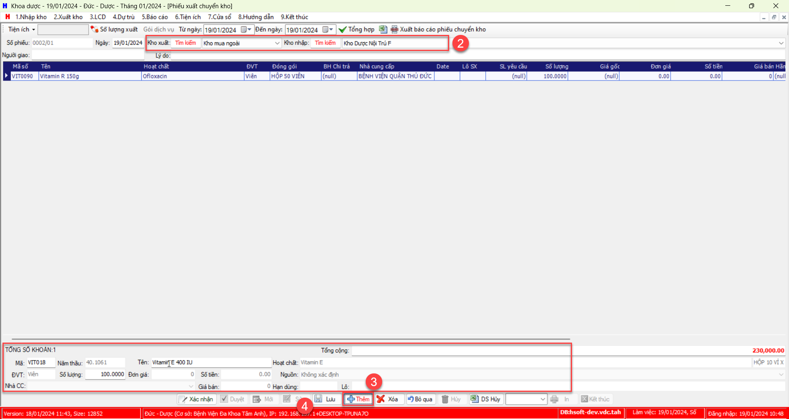
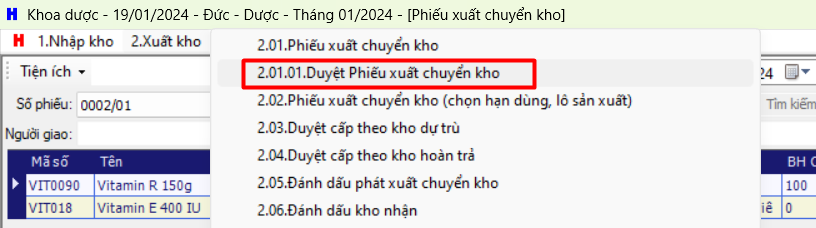
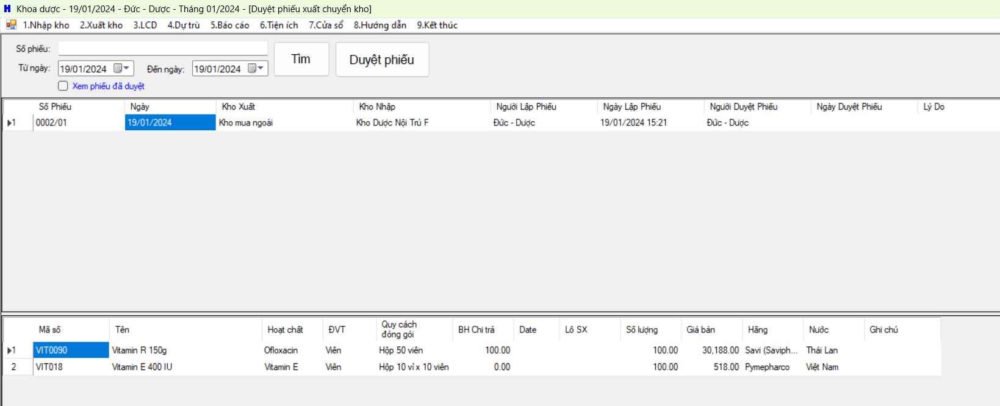
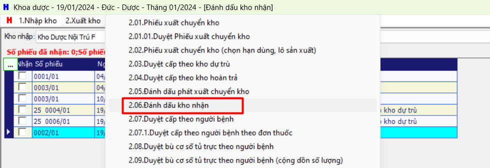
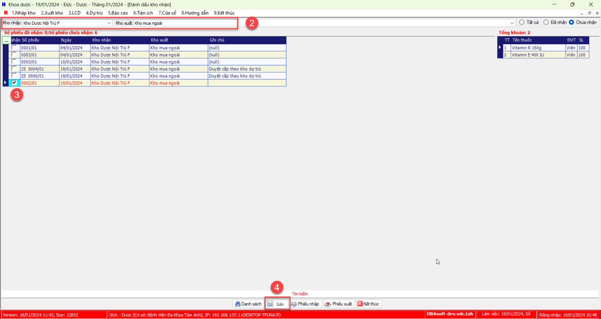

# Xuất chuyển kho

## Quy trình

## Step
### Tạo phiếu xuất chuyển kho
1. Chọn `2.Xuất kho` >> `2.01. Phiếu xuất chuyển kho` 

2. Chọn "Kho xuất", "Kho nhập"
3. Thêm thuốc 
4. Chọn `Lưu`

### Duyệt phiếu xuất chuyển kho
1. Chọn `2.Xuất kho` >> `2.01.01 Duyệt phiếu xuất chuyển kho`

2. Tìm phiếu và duyệt phiếu

### Đánh dấu kho nhận

1. Chọn `2.Xuất kho` >> `2.06 Đánh dấu kho nhận`

2. Chọn Kho >> tích phiếu cần xác nhận nhận >> chọn `Lưu`

