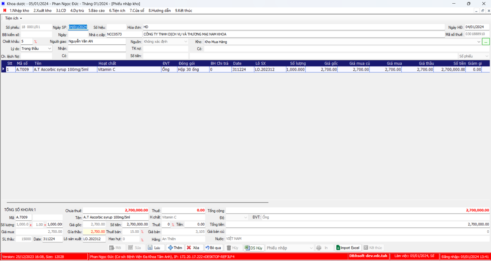

# Nhập NCC

## Step:
### Tạo hóa đơn nhà cung cấp
 1. Chọn `1.Nhập kho` >> `1.01 Phiếu nhập kho`
	- Nhập thông tin hóa đơn NCC: Số hóa đơn NCC, Nhà cung cấp, ...
	- Thêm thuốc vào hóa đơn: Tên thuốc, Số lượng, đơn giá, date (ddMMYY)

 
### Biên bản kiểm nhập
1. Chọn `5.Báo cáo` >> `5.03.Biên bản` >> `5.03.04 Kiểm nhập lọc theo hóa đơn`

