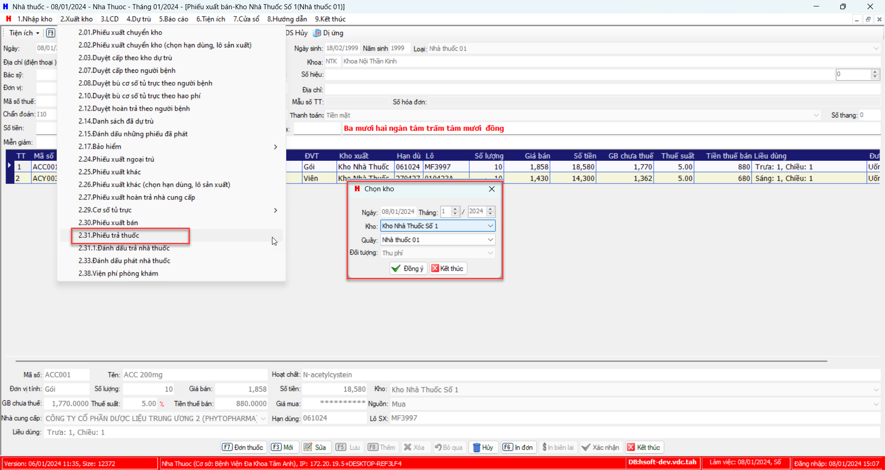
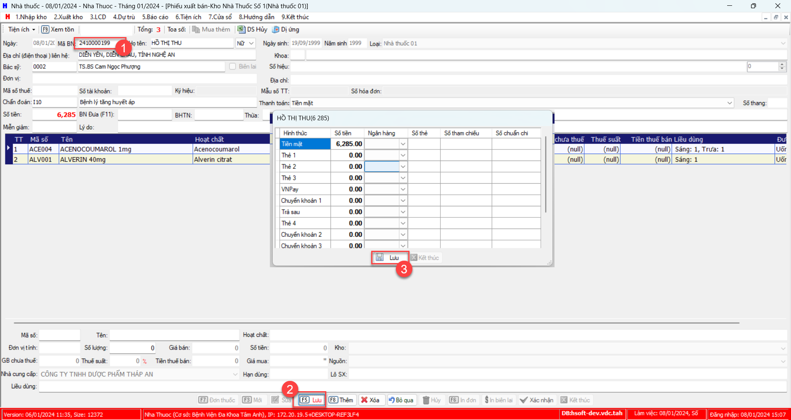

# Quy trình trả thuốc nhà thuốc
## Quy trình
- BN Phòng khám, kê 'toa mua ngoài' >> [Nhà thuốc] >> Phiếu bán thuốc
- BN Nội trú, kê 'Đơn thuốc mua ngoài' >> [Nhà thuốc] >> Phiếu bán thuốc

## Step:
Điều kiện: Bệnh nhân cần cấp toa nhà thuốc

1. Chọn `2.Xuất kho` >> `2.30 Phiếu xuất bán` >> Cho "Kho làm việc"

2. Màn hình phiếu xuất bán, 
- Nhập "Mã bệnh nhân"
- Chọn `Lưu`
- Form Thu tiền hiện lên, chọn `Lưu`

Như vậy đã hoàn thành phiếu xuất bán