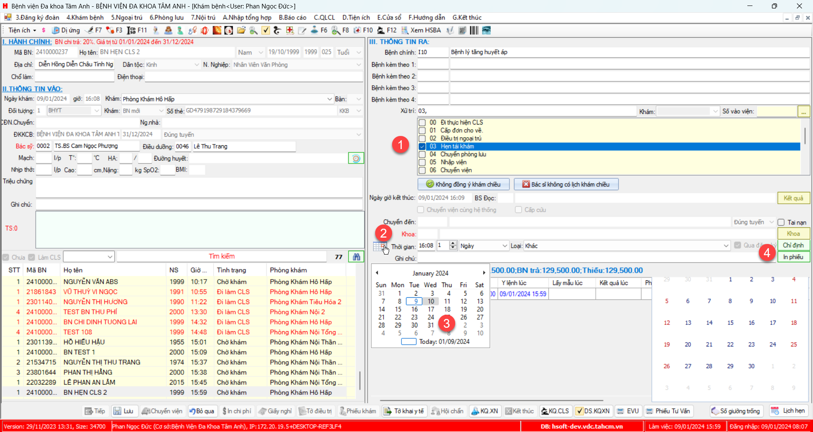

# Quy trình khám bệnh

### Khám cấp toa BHYT về

### Khám cấp toa mua ngoài.

### Khám hẹn tái khám
1. Khám và xử trí hẹn tái khám
2. Chọn buttn `Chọn ngày theo lịch`
3. Chọn ngày hẹn
4. Chọn button `Chỉ định`
5. Thêm dịch vụ và lưu lại

