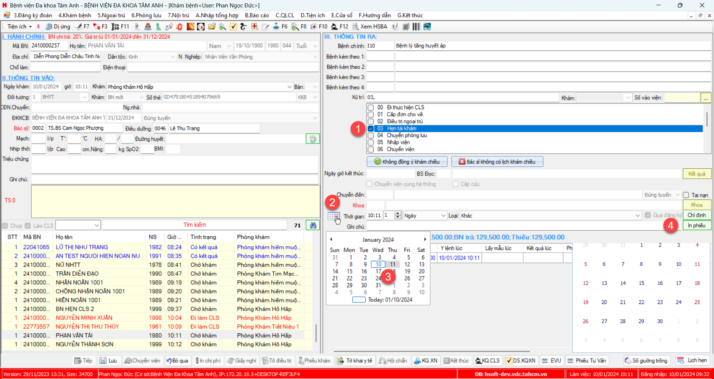
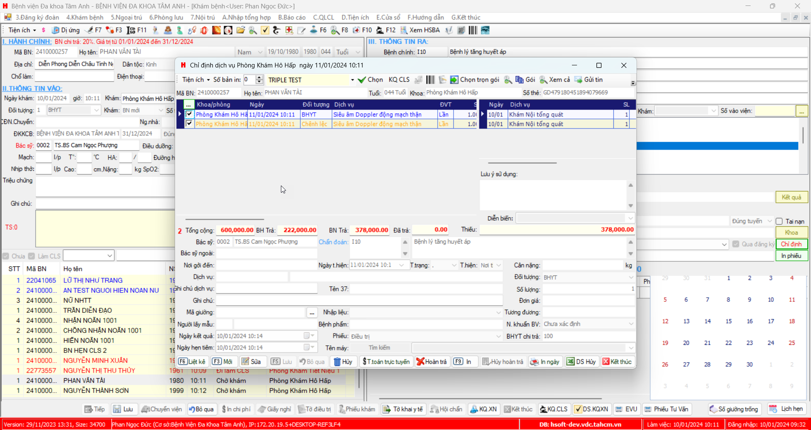

# Khám bệnh, hẹn cận lâm sàng

### Mô tả
Bệnh nhân khám, được BS chỉ định hẹn tái khám và có chỉ định CLS cho đợt khám tiếp theo
Qua ngày, bệnh nhân quay lại tái khám
### Quy trình
#### Tại phòng khám:
1. Khám và xử trí hẹn tái khám
2. Chọn buttn `Chọn ngày theo lịch`
3. Chọn ngày hẹn
4. Chọn button `Chỉ định`

5. Thêm dịch vụ và lưu lại

#### Tại Tiếp nhận
_Qua ngày sau_
1. Nhập/quét lại Mã BN

