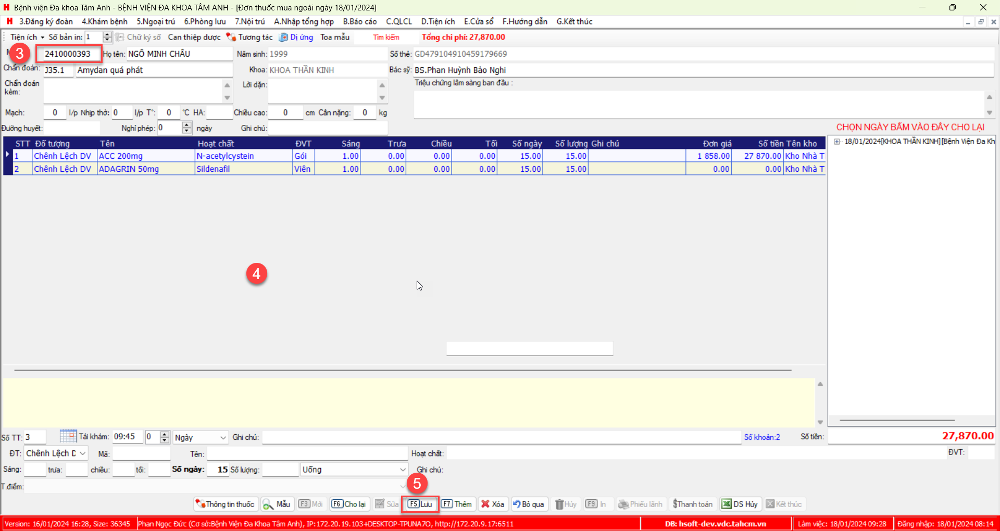

# Y lệnh cho Bệnh nhân

## Y lệnh Dịch vụ
1. Chọn bệnh nhân >> chọn `F7 Chỉ định dịch vụ`

#### Chỉ định từng dịch vụ

Tại màn hình chỉ định dịch vụ chọn button `F3 Mới` >> tìm và chọn dịch vụ cần thêm >> chọn button `F5 Lưu`

#### Chỉ định dạng liệt kê

Tại màn hình chỉ định dịch vụ chọn button `F6 Liệt kê` >> tìm và check vào dịch vụ cần thêm >> chọn button `Đồng ý` để kết thúc

## Y lệnh thuốc
### Y lệnh thuốc thường quy

### Y lệnh thuốc tủ trực

### Y lệnh toa ra viện
#### Toa ra viện Dược
1. Chọn `7.Nội trú` >> `7.17.Thuốc, vật tư y tế` >>  `7.07.07.Đơn thuốc dược phát`

2. Chọn Khoa

3. Nhập "Mã BN" và nhấn **Enter** để lấy thông tin bệnh nhân
4. Thêm thuốc vào toa
5. Nhấn `F5 Lưu` để hoàn thành toa thuốc

#### Toa ra viện Nhà thuốc
1. Chọn `7.Nội trú` >> `7.17.Thuốc, vật tư y tế` >>  `7.07.08.Đơn thuốc mua ngoài`

2. Chọn Khoa

3. Nhập "Mã BN" và nhấn **Enter** để lấy thông tin bệnh nhân
4. Thêm thuốc vào toa
5. Nhấn `F5 Lưu` để hoàn thành toa thuốc

## Tường trình PTTT
### Làm tường trình PTTT
1. Chỉ định dịch vụ Phẫu thuật, thủ thuật cho Bệnh nhân
2. Chọn Bệnh nhân >> chọn `F6 Phẫu thuật, thủ thuật` hoặc `Nhập thủ thuật`

### Các cấu hình
#### Cấu hình mẫu tường trình PTTT

1. Vào `7.Nội trú` >> `7.07. Phẫu thuật, thủ thuât` >> `7.07.04. Tường trình phẫu thuật, thủ thuật theo tên`

2. Nhập các thông tin và lưu

*Chú ý: Tên mẫu sẽ là tên 'Phương pháp thực tế' khi làm tường trình*