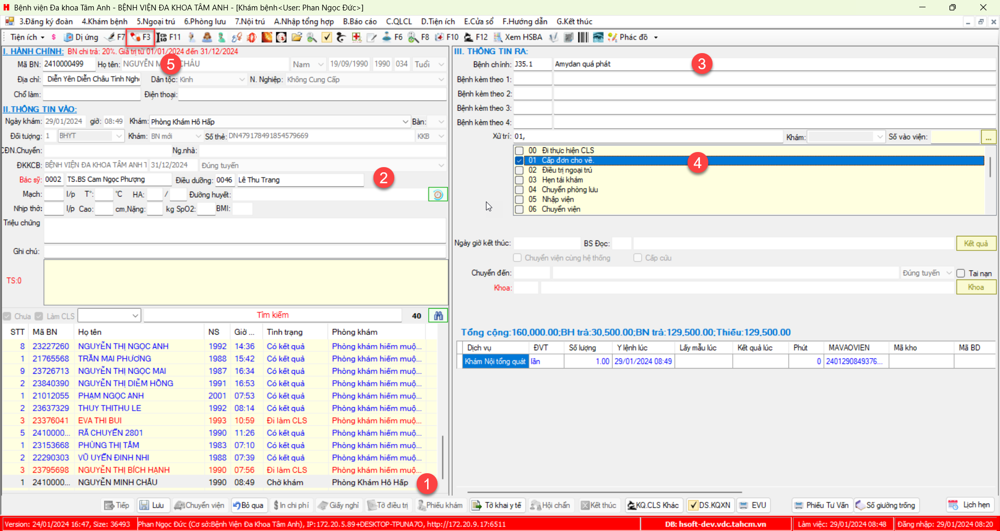

# Khám bệnh BHYT, cấp toa

 ## Quy trình

## Step:
### 1. Tiếp nhận bệnh nhân BHYT
1. Chọn `4.Khám bệnh` >> `4.15 Đăng ký khám bệnh mới`

3. Tại màn hình Tiếp nhận:
   - Nhập thông tin Bệnh nhân
   - Nhập thông tin thẻ BHYT
   - Thêm Phòng khám
   - Chọn Lưu

Thông báo thành công khi lưu thành công

### 2. Khám
1. Chọn `4.Khám bệnh` >> `4.14 Phiếu khám bệnh`

2. Chọn BN khám >> Chọn BS khám >> Nhập ICD chính >> Tích vào xử trí "Cấp đơn cho về" >> Chọn `Toa thuốc (F3)`

3. Tại màn hình nhập thuốc, Nhập thuốc >> chọn button `F7 Thêm` để thêm thuốc >> chọn button `F5 Lưu` để lưu toa thuốc 

### 3. In BV01
1. Tại Hsoft Dược, chọn `2.Xuất kho` >> `2.17 Bảo hiểm` >> `2.17.04 Viện phí`

2. Chọn Kho làm việc

### 4. Thanh toán chi phí
1. Tại Hsoft Viện phí, chọn `1.Viện phí` >> `1.02 Thu viện phí ngoại trú` >> Chọn quyền sổ thu tiền

2. Chọn `Danh sách` >> Nhấp đôi vào BN cần thanh toán

3. Sau khi load được chi phí, chọn `Lưu` để mở form tính tiền >> Chọn tiếp `Lưu` để tiến hành thu tiền

Sau khi thanh toán thành công, phần mềm sẽ hiển thị các phiếu thu, phiếu in

### 5. Phát thuốc BHYT

1. Chọn `2.Xuất kho` >> `2.17 Bảo hiểm` >> `2.17.03 Phát thuốc`

2. Chọn Kho làm việc

3. Xác nhận phát thuốc

Như vây đã hoàn thành quy trình "Khám BHYT cấp toa về"