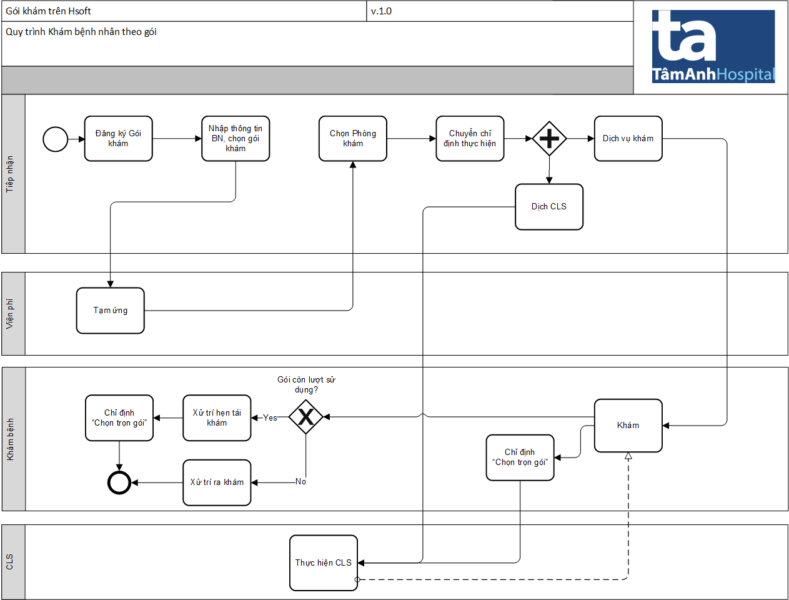

# Khám Gói khám

## Quy trình

## Step

#### 1. Đăng ký gói khám

1. Vào `4.Khám bệnh` >> `4.12 Đăng ký gói khám`

2. Nhập thông tin bệnh nhân khám và chọn `Chọn gói`

3. Tích gói khám mong muốn và chọn "Đồng ý"

Chi tiết gói sẽ hiển thị ra danh sách

#### 2. Tạm ứng viện phí

1. Đăng nhập vào Hsoft Viện phí >> Tạm ứng >> Loại bệnh nhân = "Tiếp đón" >> chọn "Danh sách chờ"

2. Chọn loại tạm ứng >> chọn `Lưu và in`

#### 3. CHuyển chỉ định thực hiện

1. Sau khi BN đã tạm ứng, ở Hsoft đăng ký gói >> lấy lại BN. 
2. Chọn PK với dịch vụ khám tương ứng trong gói để BN hiện diện tại PK.
3. Tích vào DV khám và CLS (Những DV CLS nào không tích thì vào PK BS có thể tích)

Lúc này BN sẽ hiện diện tại Phòng khám

#### 4.Phòng khám tích dịch vụ gói

1. Tại PK, chọn BN có gói khám >> khám, chọn Chỉ định Dịch vụ
2. Ở màn hình "Chỉ định dịch vụ" chọn `Chọn trọn gói`

3. Tích vào Dịch vụ cần thực hiện, và chọn `Chọn`

Như vậy là hoàn tất quy trình tiếp nhận khám gói,
Trường hợp gói còn lượt sử dụng, Bác sĩ có thể xử trí hẹn và "Chỉ định dịch vụ" chọn `Chọn trọn gói`

