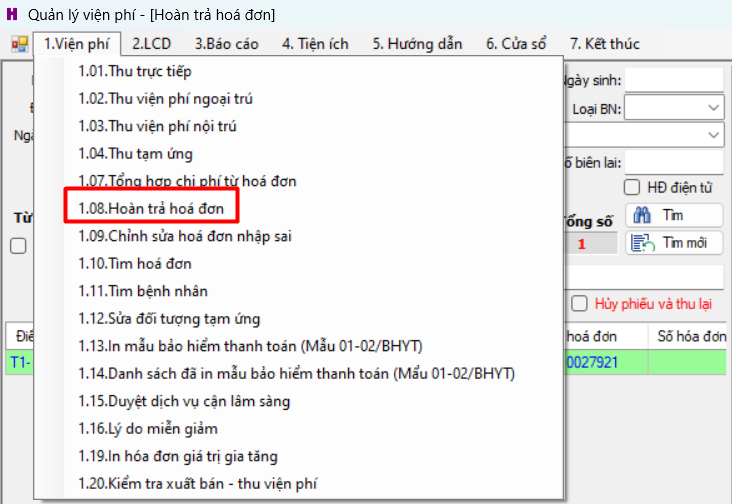
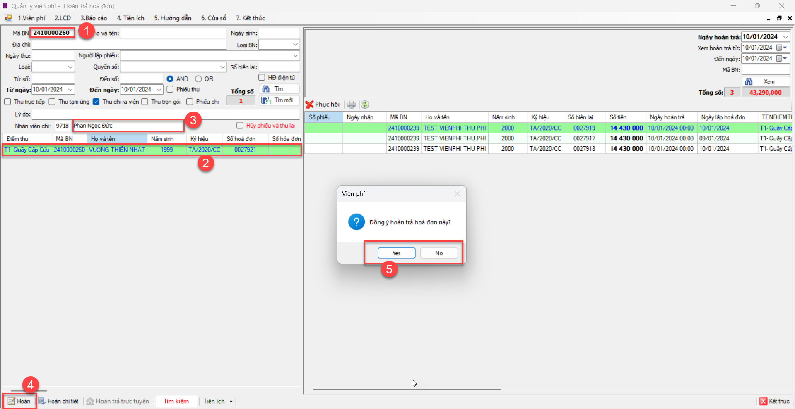
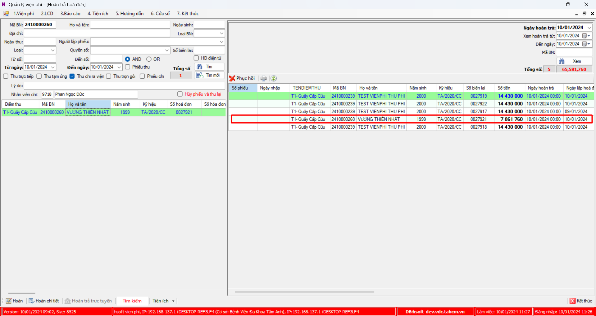
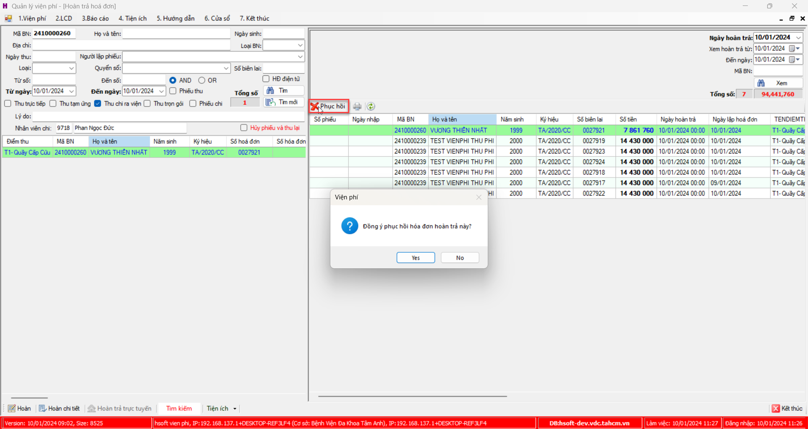

# Hoàn hóa đơn

## Step:
### Hoàn trả phiếu
1. Chọn `1.Viện phí` >> `1.08 Hoàn trả hóa đơn`

2. Tại màn hình "Hoàn trả hóa đơn":
- Nhập mã bệnh nhân
- Chọn phiếu cần hoàn trả
- Chọn Nhân viên chi (Chú ý: Nhân viên phải được phân quyền hoàn trả)
- Chọn button `Hoàn`
- Xác nhận "Yes/No", Yes - hoàn, No-Hủy bỏ thao tác

Sau khi hoàn thành công, danh sách sẽ hiện diện

### Phục hồi phiếu hoàn tra
Chọn Phiếu cần phục hồi, chọn `Phục hồi` >> xác nhận

