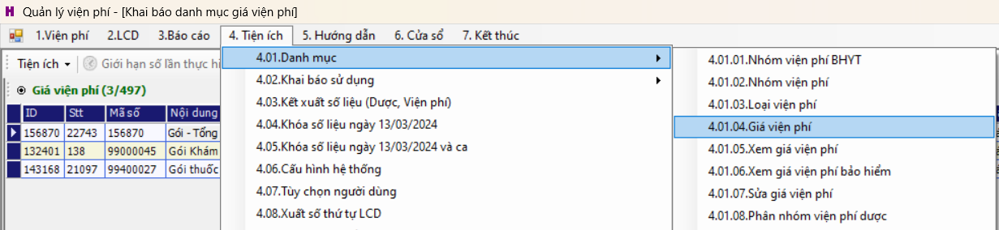
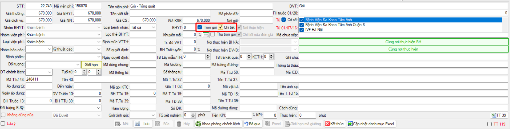
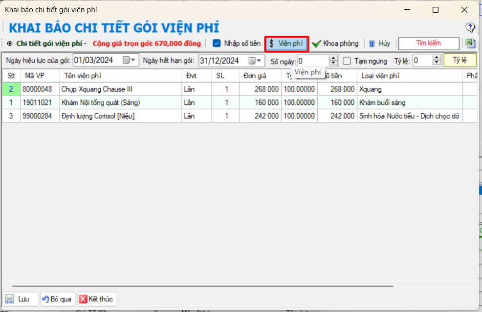
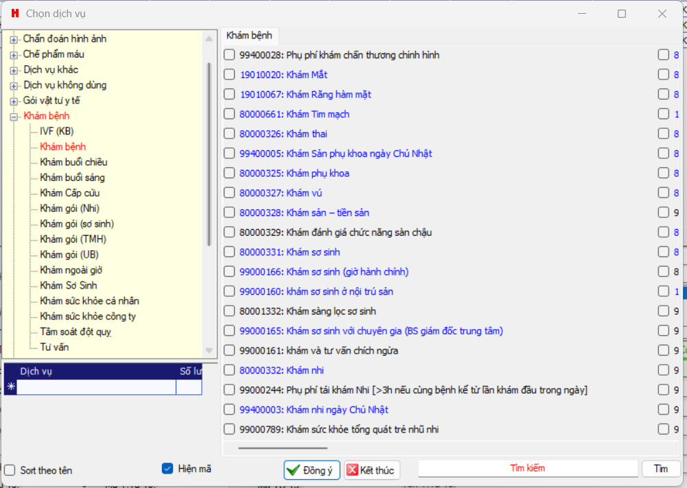

# Tạo gói khám

## Mô tả:
Tạo gói khám để đăng ký khám tại `Đăng ký gói khám`
## Step:

1. Vào Viện phí >> `4.01.04. Giá viện phí`

2. Nhập thông tin gói, tích vào trọn gói và chọn "Chi tiết"

3. Form "*Khai báo chi tiết gói viện phí*" hiện lên, tích vào `Viện phí`

4. Tích chọn dịch vụ muốn thêm vào gói

