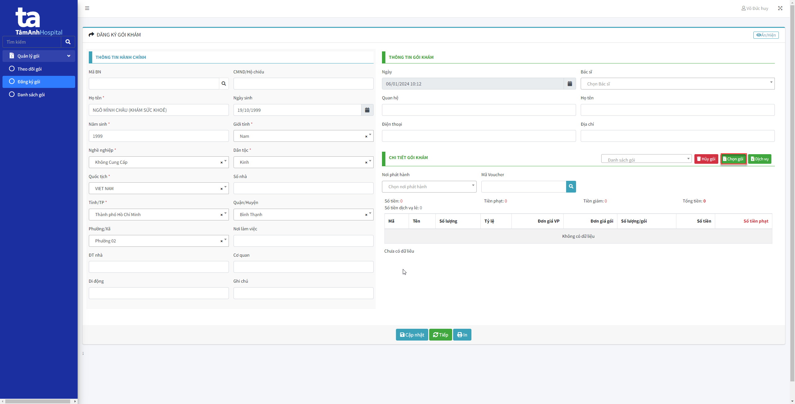
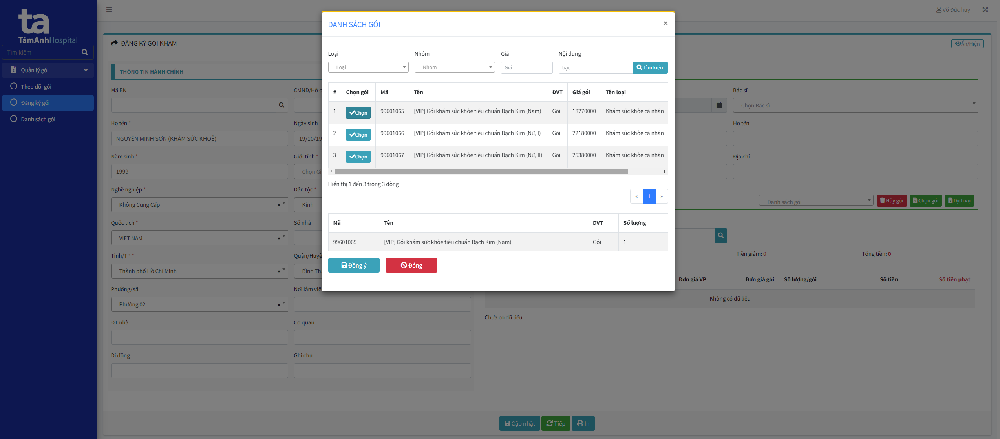
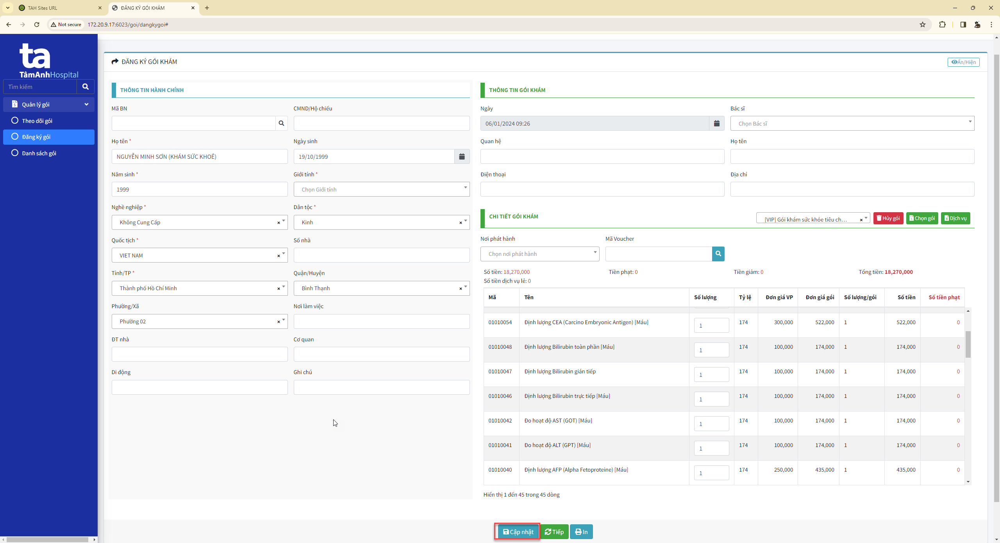
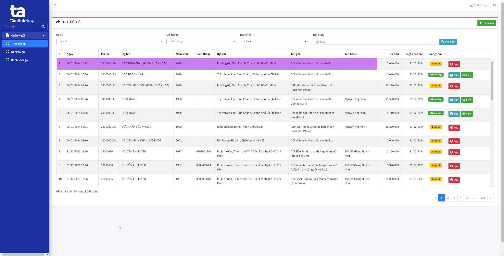

# Đăng ký từ Đăng ký gói

## Đăng ký gói
1. Truy cập link [Quản lý gói](http://172.20.9.17:6023/)
2. Chọn menu "Đăng ký gói"
3. Nhâp thông tin người đăng ký khám 
4. Chọn button "Chọn gói" để chọn gói khám

5. Chọn gói khám sức khỏe

6. Sau khi chọn gói xong, chọn Cập nhật để đăng ký gói

Sau khi cập nhật thành công, thông tin sẽ hiển thị ở "Theo dõi gói" với trạng thái là đăng ký

## Thu tạm ứng

