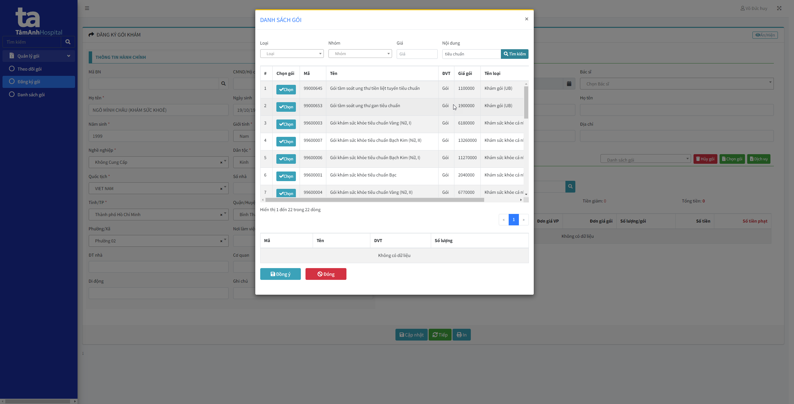
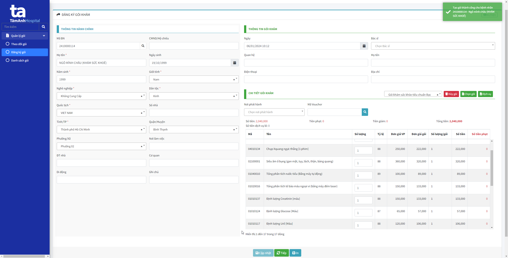

# Đăng ký từ Đăng ký gói

## Đăng ký gói
1. Truy cập link [Quản lý gói](http://172.20.9.17:6023/)
2. Chọn menu "Đăng ký gói"
3. Nhâp thông tin người đăng ký khám 
4. Chọn button "Chọn gói" để chọn gói khám

5. Chọn gói khám sức khỏe

6. Sau khi chọn gói xong, chọn Cập nhật để đăng ký gói

Sau khi cập nhật thành công, thông tin sẽ hiển thị ở "Theo dõi gói" với trạng thái là đăng ký

## Thu tạm ứng (tại Hsoft VP)
1. Vào "Quản lý viện phí", chọn `1.Viện phí` >> `1.04 Thu tạm ứng`

2. Nhập mã bệnh nhân để lấy thông tin người thu, chọn "Lưu và in" và tiến hành thu tạm ứng

3. Lúc này thông tin người khám sức khỏe sẽ là "Đã tạm ứng"

## Checking tại QMS điều phối
1. Truy cập vào [QMS điều phối](http://qmstest.tahospital.vn/feature/arrange)
2. Tại màn hình điều phối:
- Nhập mã người khám sức khỏe
- Chọn phòng khám cho các công khám thiếu phòng khám
- Tích các chi tiết trong gói
- Chọn "Đăng ký HSOFT"

3. Sau khi đăng ký, khách hàng sẽ hiển thị tại màn hình "Khám sức khỏe"

