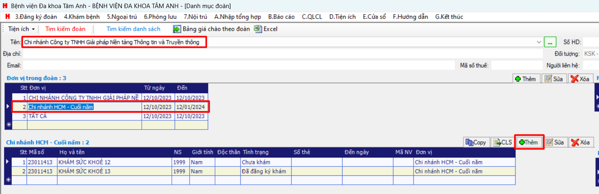

# Đăng ký

## Từ Hsoft
### Đăng ký danh sách đoàn
1. Chọn `3. Đăng ký đoàn` >>  `3.02 Đăng ký danh sách đoàn khám sức khỏe`

2. Tại màn hình danh mục đoàn, chọn `Tên đoàn` >> chọn `Đơn vị đoàn` >> Chọn button `Thêm`

3. Tại form "Thông tin"Nhập thông tin và Lưu

*Chú ý: Cần đặt trỏ chuột tại ô Mã BN và nhấn Enter để tạo mã BN trước*

Sau khi lưu thành công, thông tin sẽ hiển diện tại DS

### Chỉ định Khám sức khoẻ
1. chọn `3.Đăng ký đoàn` >> `3.03 Chỉ định Khám sức khoẻ `

2. Tại màn hình "Chỉ định khám sức khỏe", 
- Chọn "Đoàn, đơn vị"
- Chọn "Họ tên"
-  Tích "Tiền sử bệnh (Nếu có)"
- Tích "Phòng khám"
- Lưu

Sau khi lưu thành công, Người khám sức khỏe sẽ hiển thị tại màn hình Khám sức khỏe

